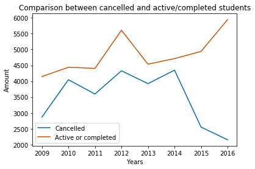
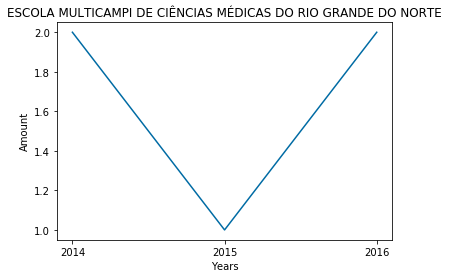

# IMD0033 - Probabilidade #

## Project: UFRN's Open Data Evaluation - Canceled Registrations from 2009 to 2016

### Students: ###
20170000600 - Gabriel Igor Queiroz Costa <br>
20170060090 - João Pedro de Amorim Paula <br>
20170063851 - Vitor Henrique Coelho Bezerra

### 1. Introduction ###

The Open Data Portal of the Federal University of Rio Grande do Norte - UFRN (URL: http://dados.ufrn.br/group/ensino) is a tool which main objective is to make available, to the whole community, data and public information of the Institution.

In this notebook, we accessed data from the students of the university with the goal to analyze the quantity of canceled registrations between 2009 and 2016.

### 2. Setting color according Color Blind palette

According to this [link](https://github.com/ivanovitchm/imd0033_2018_1/blob/master/Aula%2015%20-%20Visualiza%C3%A7%C3%A3o%20Explorat%C3%B3ria%20de%20Dados%20II/%20Exploratory%20Data%20Visualization%20II%20-%20Color%2C%20Layout%2C%20And%20Annotations.ipynb), the Color Blind palette contains ten colors that are colorblind friendly. Here we used the one called Color Blind 10 released by the company Tableau. Navitage to this [page](http://tableaufriction.blogspot.com.br/2012/11/finally-you-can-use-tableau-data-colors.html) for more details. Here we set three of the colors from the Color Blind 10's scheme to color the charts.


```python
_orange = (200/255,82/255,0/255)
_green = (44/255,160/255,44/255)
dark_blue = (0/255,107/255,164/255)
```

### 3. Starting out with pandas ###

In this code snippet we read the csv's to store each year's information in a `pandas` DataFrame in order to extract what we want. The name of the variable comes from the student, which in portuguese is written as *"aluno"* or *"discente"*.

These are the python packages we will need. `pandas` for manupulation and analysis of the `csv` files, `matplotlib` and `seaborn` to generate graphics to visualize the results. 


```python
import pandas as pd
import matplotlib.pyplot as plt
import seaborn as sns
import numpy as np
```

Right after, the first thing we do is read each `csv` file and store them in a `pandas` DataFrame. We kept 2017 and 2018 out of this for two reasons:

1. The 2017 `csv` said that all of the students had entered the university in 2009, which makes no sense;
2. Since we're still in 2018, the 2018 file is incomplete, so it's result would just make it harder to analyze the graphics.


```python
dis09 = pd.read_csv('res/discentes-2009.csv', sep=';', encoding='utf8')
dis10 = pd.read_csv('res/discentes-2010.csv', sep=';', encoding='utf8')
dis11 = pd.read_csv('res/discentes-2011.csv', sep=';', encoding='utf8')
dis12 = pd.read_csv('res/discentes-2012.csv', sep=';', encoding='utf8')
dis13 = pd.read_csv('res/discentes-2013.csv', sep=';', encoding='utf8')
dis14 = pd.read_csv('res/discentes-2014.csv', sep=';', encoding='utf8')
dis15 = pd.read_csv('res/discentes-2015.csv', sep=';', encoding='utf8')
dis16 = pd.read_csv('res/discentes-2016.csv', sep=';', encoding='utf8')
dis17 = pd.read_csv('res/discentes-2017.csv', sep=';', encoding='utf8')
dis18 = pd.read_csv('res/discentes-2018.csv', sep=';', encoding='utf8')
```

We only want to work with graduation students, so that's what this code is doing. Also, there are some columns that do not have much use for use, so we store their id's in a variable (`drop_cols`) and drop them from the DataFrame.


```python
drop_cols = ['periodo_ingresso', 'forma_ingresso', 'tipo_discente', 'sigla_nivel_ensino', 'id_unidade_gestora', 'nome_unidade_gestora', 'forma_ingresso']

dis09 = dis09[dis09.nivel_ensino == 'GRADUAÇÃO'].drop(drop_cols, axis=1)
dis10 = dis10[dis10.nivel_ensino == 'GRADUAÇÃO'].drop(drop_cols, axis=1)
dis11 = dis11[dis11.nivel_ensino == 'GRADUAÇÃO'].drop(drop_cols, axis=1)
dis12 = dis12[dis12.nivel_ensino == 'GRADUAÇÃO'].drop(drop_cols, axis=1)
dis13 = dis13[dis13.nivel_ensino == 'GRADUAÇÃO'].drop(drop_cols, axis=1)
dis14 = dis14[dis14.nivel_ensino == 'GRADUAÇÃO'].drop(drop_cols, axis=1)
dis15 = dis15[dis15.nivel_ensino == 'GRADUAÇÃO'].drop(drop_cols, axis=1)
dis16 = dis16[dis16.nivel_ensino == 'GRADUAÇÃO'].drop(drop_cols, axis=1)
dis17 = dis17[dis17.nivel_ensino == 'GRADUAÇÃO'].drop(drop_cols, axis=1)
dis18 = dis18[dis18.nivel_ensino == 'GRADUAÇÃO'].drop(drop_cols, axis=1)
```

Drop all the *NULL* or *NaN* (Not a Number) rows.


```python
dis09.dropna(inplace=True)
dis10.dropna(inplace=True)
dis11.dropna(inplace=True)
dis12.dropna(inplace=True)
dis13.dropna(inplace=True)
dis14.dropna(inplace=True)
dis15.dropna(inplace=True)
dis16.dropna(inplace=True)
dis17.dropna(inplace=True)
dis18.dropna(inplace=True)
```

The next step is to read a file that contains all of the university graduate courses in UFRN, and store that in a variable courses. In this data frame, we must replace the name column 'nome' to 'nome_curso', because it represents the same value.


```python
courses = pd.read_csv('res/cursos-ufrn.csv', sep=';', encoding='utf-8')
courses = courses[courses.nivel_ensino == 'GRADUAÇÃO']
courses.rename(columns={'nome': 'nome_curso'}, inplace=True)
```

### 4. Uniting all the DataFrames into one  ###

Here we `concat` all of the DataFrames into a single one that contains only the cancelled students, as well as another DataFrame containing students that still have an active registration or have finished their courses.

Note: In dis_canceled and dis_activ data frame we treated all rows with 'ADMINISTRAÇÃO -' and 'HISTÓRIA -' values replacing to 'ADMINISTRAÇÃO' and 'HISTÓRIA', because it represents the same course.


```python
dis_cancelled = pd.concat([dis09, dis10, dis11, dis12, dis13, dis14, dis15, dis16], ignore_index=True)
dis_cancelled = dis_cancelled[dis_cancelled.status == 'CANCELADO']
dis_cancelled = dis_cancelled[~dis_cancelled.matricula.duplicated()]
dis_cancelled = dis_cancelled.replace({'ADMINISTRAÇÃO -': 'ADMINISTRAÇÃO'})
dis_cancelled = dis_cancelled.replace({'HISTÓRIA -': 'HISTÓRIA'})

dis_active = pd.concat([dis09, dis10, dis11, dis12, dis13, dis14, dis15, dis16], ignore_index=True)
dis_active = dis_active[dis_active.status != "CANCELADO"]
dis_active = dis_active[~dis_active.matricula.duplicated()]
dis_active = dis_active.replace({'ADMINISTRAÇÃO -': 'ADMINISTRAÇÃO'})
dis_active = dis_active.replace({'HISTÓRIA -': 'HISTÓRIA'})
```

Here we drop all the columns from courses not needed to the analysis and we `merge` the result with the dis_cancelled data frame.


```python
column = ['unidade_responsavel'] + list(dis_cancelled.columns.values)
column_drop = ['modalidade_educacao', 'nivel_ensino', 'situacao_curso',
               'grau_academico', 'tipo_oferta', 'tipo_ciclo_formacao', 'turno', 'municipio',
               'data_funcionamento', 'codigo_inep', 'website', 'dou', 'id_coordenador', 'coordenador',
               'portaria_reconhecimento', 'convenio_academico', 'nome_curso']
merge_coursesdis= pd.merge(courses.drop(column_drop,axis=1), dis_cancelled, on='id_curso')
merge_coursesdis.head()
```


<div>
<table border="1" class="dataframe">
  <thead>
    <tr style="text-align: right;">
      <th></th>
      <th>id_curso</th>
      <th>area_conhecimento</th>
      <th>campus</th>
      <th>id_unidade_responsavel</th>
      <th>unidade_responsavel</th>
      <th>matricula</th>
      <th>nome_discente</th>
      <th>ano_ingresso</th>
      <th>status</th>
      <th>nivel_ensino</th>
      <th>nome_curso</th>
      <th>modalidade_educacao</th>
      <th>id_unidade</th>
      <th>nome_unidade</th>
    </tr>
  </thead>
  <tbody>
    <tr>
      <th>0</th>
      <td>2000002</td>
      <td>Ciências Sociais Aplicadas</td>
      <td>Campus Central</td>
      <td>443</td>
      <td>CENTRO DE CIÊNCIAS SOCIAIS APLICADAS</td>
      <td>2.009007e+09</td>
      <td>ADSON ARACELI ALVES DANTAS</td>
      <td>2009</td>
      <td>CANCELADO</td>
      <td>GRADUAÇÃO</td>
      <td>ADMINISTRAÇÃO</td>
      <td>PRESENCIAL</td>
      <td>443.0</td>
      <td>CENTRO DE CIÊNCIAS SOCIAIS APLICADAS</td>
    </tr>
    <tr>
      <th>1</th>
      <td>2000002</td>
      <td>Ciências Sociais Aplicadas</td>
      <td>Campus Central</td>
      <td>443</td>
      <td>CENTRO DE CIÊNCIAS SOCIAIS APLICADAS</td>
      <td>2.009008e+09</td>
      <td>ALINNE STÉPHANIE COTA DE SÁ</td>
      <td>2009</td>
      <td>CANCELADO</td>
      <td>GRADUAÇÃO</td>
      <td>ADMINISTRAÇÃO</td>
      <td>PRESENCIAL</td>
      <td>443.0</td>
      <td>CENTRO DE CIÊNCIAS SOCIAIS APLICADAS</td>
    </tr>
    <tr>
      <th>2</th>
      <td>2000002</td>
      <td>Ciências Sociais Aplicadas</td>
      <td>Campus Central</td>
      <td>443</td>
      <td>CENTRO DE CIÊNCIAS SOCIAIS APLICADAS</td>
      <td>2.009007e+09</td>
      <td>ALRIANE SILVESTRE DA SILVA</td>
      <td>2009</td>
      <td>CANCELADO</td>
      <td>GRADUAÇÃO</td>
      <td>ADMINISTRAÇÃO</td>
      <td>PRESENCIAL</td>
      <td>443.0</td>
      <td>CENTRO DE CIÊNCIAS SOCIAIS APLICADAS</td>
    </tr>
    <tr>
      <th>3</th>
      <td>2000002</td>
      <td>Ciências Sociais Aplicadas</td>
      <td>Campus Central</td>
      <td>443</td>
      <td>CENTRO DE CIÊNCIAS SOCIAIS APLICADAS</td>
      <td>2.009008e+09</td>
      <td>ANA CAMILA DO NASCIMENTO JANUÁRIO</td>
      <td>2009</td>
      <td>CANCELADO</td>
      <td>GRADUAÇÃO</td>
      <td>ADMINISTRAÇÃO</td>
      <td>PRESENCIAL</td>
      <td>443.0</td>
      <td>CENTRO DE CIÊNCIAS SOCIAIS APLICADAS</td>
    </tr>
    <tr>
      <th>4</th>
      <td>2000002</td>
      <td>Ciências Sociais Aplicadas</td>
      <td>Campus Central</td>
      <td>443</td>
      <td>CENTRO DE CIÊNCIAS SOCIAIS APLICADAS</td>
      <td>2.009007e+09</td>
      <td>ANA JÚLIA NUNES DE ARAÚJO</td>
      <td>2009</td>
      <td>CANCELADO</td>
      <td>GRADUAÇÃO</td>
      <td>ADMINISTRAÇÃO</td>
      <td>PRESENCIAL</td>
      <td>443.0</td>
      <td>CENTRO DE CIÊNCIAS SOCIAIS APLICADAS</td>
    </tr>
  </tbody>
</table>
</div>


### 5. Table with number of cancellations per year ###

This pivot table is used to store the amount of cancelled registrations in each course, each year.


```python
pivot = pd.pivot_table(merge_coursesdis,
                       index='ano_ingresso',
                       columns='nome_curso',
                       aggfunc="count").fillna(0).astype(int)
pivot.reset_index(inplace=True)
pivot
```


<div>
<table border="1" class="dataframe">
  <thead>
    <tr>
      <th></th>
      <th>ano_ingresso</th>
      <th colspan="9" halign="left">area_conhecimento</th>
      <th>...</th>
      <th colspan="10" halign="left">unidade_responsavel</th>
    </tr>
    <tr>
      <th>nome_curso</th>
      <th></th>
      <th>ADMINISTRAÇÃO</th>
      <th>ADMINISTRAÇÃO PÚBLICA</th>
      <th>AGRONOMIA</th>
      <th>ANÁLISE E DESENVOLVIMENTO DE SISTEMAS</th>
      <th>ARQUITETURA E URBANISMO</th>
      <th>ARTES VISUAIS</th>
      <th>BIBLIOTECONOMIA</th>
      <th>BIOMEDICINA</th>
      <th>CIÊNCIA DA COMPUTAÇÃO</th>
      <th>...</th>
      <th>PEDAGOGIA</th>
      <th>PSICOLOGIA</th>
      <th>QUÍMICA</th>
      <th>QUÍMICA DO PETRÓLEO</th>
      <th>SERVIÇO SOCIAL</th>
      <th>SISTEMAS DE INFORMAÇÃO</th>
      <th>TEATRO</th>
      <th>TECNOLOGIA DA INFORMAÇÃO</th>
      <th>TURISMO</th>
      <th>ZOOTECNIA</th>
    </tr>
  </thead>
  <tbody>
    <tr>
      <th>0</th>
      <td>2009</td>
      <td>74</td>
      <td>0</td>
      <td>0</td>
      <td>0</td>
      <td>6</td>
      <td>17</td>
      <td>11</td>
      <td>19</td>
      <td>36</td>
      <td>...</td>
      <td>52</td>
      <td>14</td>
      <td>176</td>
      <td>16</td>
      <td>13</td>
      <td>36</td>
      <td>13</td>
      <td>0</td>
      <td>52</td>
      <td>64</td>
    </tr>
    <tr>
      <th>1</th>
      <td>2010</td>
      <td>65</td>
      <td>247</td>
      <td>0</td>
      <td>0</td>
      <td>5</td>
      <td>19</td>
      <td>12</td>
      <td>28</td>
      <td>36</td>
      <td>...</td>
      <td>60</td>
      <td>15</td>
      <td>279</td>
      <td>17</td>
      <td>16</td>
      <td>40</td>
      <td>26</td>
      <td>0</td>
      <td>58</td>
      <td>67</td>
    </tr>
    <tr>
      <th>2</th>
      <td>2011</td>
      <td>81</td>
      <td>194</td>
      <td>25</td>
      <td>0</td>
      <td>4</td>
      <td>26</td>
      <td>14</td>
      <td>39</td>
      <td>43</td>
      <td>...</td>
      <td>58</td>
      <td>9</td>
      <td>130</td>
      <td>15</td>
      <td>23</td>
      <td>38</td>
      <td>18</td>
      <td>0</td>
      <td>62</td>
      <td>40</td>
    </tr>
    <tr>
      <th>3</th>
      <td>2012</td>
      <td>70</td>
      <td>0</td>
      <td>15</td>
      <td>0</td>
      <td>4</td>
      <td>18</td>
      <td>14</td>
      <td>30</td>
      <td>38</td>
      <td>...</td>
      <td>287</td>
      <td>8</td>
      <td>227</td>
      <td>10</td>
      <td>13</td>
      <td>38</td>
      <td>18</td>
      <td>0</td>
      <td>83</td>
      <td>27</td>
    </tr>
    <tr>
      <th>4</th>
      <td>2013</td>
      <td>105</td>
      <td>0</td>
      <td>21</td>
      <td>21</td>
      <td>7</td>
      <td>23</td>
      <td>32</td>
      <td>22</td>
      <td>19</td>
      <td>...</td>
      <td>106</td>
      <td>11</td>
      <td>155</td>
      <td>28</td>
      <td>33</td>
      <td>25</td>
      <td>15</td>
      <td>153</td>
      <td>71</td>
      <td>34</td>
    </tr>
    <tr>
      <th>5</th>
      <td>2014</td>
      <td>106</td>
      <td>115</td>
      <td>26</td>
      <td>18</td>
      <td>6</td>
      <td>21</td>
      <td>24</td>
      <td>27</td>
      <td>0</td>
      <td>...</td>
      <td>219</td>
      <td>15</td>
      <td>180</td>
      <td>43</td>
      <td>39</td>
      <td>33</td>
      <td>9</td>
      <td>163</td>
      <td>72</td>
      <td>25</td>
    </tr>
    <tr>
      <th>6</th>
      <td>2015</td>
      <td>84</td>
      <td>0</td>
      <td>15</td>
      <td>17</td>
      <td>4</td>
      <td>16</td>
      <td>21</td>
      <td>21</td>
      <td>0</td>
      <td>...</td>
      <td>64</td>
      <td>10</td>
      <td>83</td>
      <td>21</td>
      <td>33</td>
      <td>25</td>
      <td>12</td>
      <td>134</td>
      <td>40</td>
      <td>11</td>
    </tr>
    <tr>
      <th>7</th>
      <td>2016</td>
      <td>54</td>
      <td>0</td>
      <td>11</td>
      <td>18</td>
      <td>4</td>
      <td>12</td>
      <td>22</td>
      <td>15</td>
      <td>1</td>
      <td>...</td>
      <td>61</td>
      <td>12</td>
      <td>62</td>
      <td>19</td>
      <td>27</td>
      <td>14</td>
      <td>9</td>
      <td>111</td>
      <td>39</td>
      <td>9</td>
    </tr>
  </tbody>
</table>
<p>8 rows × 961 columns</p>
</div>


### 6. Table with the amount each year's cancelled students ###

This table is used to show the total of each year's cancelled registrations.


```python
x = pd.pivot_table(merge_coursesdis,
                   index='ano_ingresso',
                   values='nome_curso',
                   aggfunc='count').fillna(0).astype(int).reset_index()
x.rename(columns={'nome_curso': 'amount'}, inplace=True)
x
```


<div>
<table border="1" class="dataframe">
  <thead>
    <tr style="text-align: right;">
      <th></th>
      <th>ano_ingresso</th>
      <th>amount</th>
    </tr>
  </thead>
  <tbody>
    <tr>
      <th>0</th>
      <td>2009</td>
      <td>2866</td>
    </tr>
    <tr>
      <th>1</th>
      <td>2010</td>
      <td>4047</td>
    </tr>
    <tr>
      <th>2</th>
      <td>2011</td>
      <td>3596</td>
    </tr>
    <tr>
      <th>3</th>
      <td>2012</td>
      <td>4330</td>
    </tr>
    <tr>
      <th>4</th>
      <td>2013</td>
      <td>3923</td>
    </tr>
    <tr>
      <th>5</th>
      <td>2014</td>
      <td>4349</td>
    </tr>
    <tr>
      <th>6</th>
      <td>2015</td>
      <td>2552</td>
    </tr>
    <tr>
      <th>7</th>
      <td>2016</td>
      <td>2151</td>
    </tr>
  </tbody>
</table>
</div>


This chart is used to show the total of each year's cancelled registration.


```python

plt.plot(x['ano_ingresso'], 
         x['amount'], c=_green, label='Students')
plt.legend(loc='best')
plt.xlabel('Years')
plt.ylabel('Amount')
plt.title('Total of cancelled registrations from 2009 to 2016')
plt.show()
```


### 7. Cancelled students of some units ##

In this section we separate the number os cancelled students by unit, that is, by the unit responsible by the course.

#### 7.1. Name of all units ####


```python
merge_coursesdis.unidade_responsavel.unique().tolist()
```


    ['CENTRO DE CIÊNCIAS SOCIAIS APLICADAS',
     'CENTRO DE  ENSINO SUPERIOR DO SERIDÓ',
     'ESCOLA AGRÍCOLA DE JUNDIAÍ',
     'CENTRO DE TECNOLOGIA',
     'CENTRO DE CIÊNCIAS HUMANAS, LETRAS E ARTES',
     'CENTRO DE BIOCIÊNCIAS',
     'CENTRO DE CIÊNCIAS EXATAS E DA TERRA',
     'ESCOLA DE CIÊNCIAS E TECNOLOGIA',
     'CENTRO DE CIÊNCIAS DA SAÚDE',
     'FACULDADE DE CIÊNCIAS DA SAÚDE DO TRAIRI - FACISA',
     'ESCOLA DE SAÚDE',
     'ESCOLA MULTICAMPI DE CIÊNCIAS MÉDICAS DO RIO GRANDE DO NORTE',
     'ESCOLA DE MÚSICA',
     'CENTRO DE EDUCAÇÃO',
     'INSTITUTO METROPOLE DIGITAL']


#### 7.2. Bio and Health Sciences units ###

Here we concatenate the courses with the responsable unit called 'CENTRO DE CIÊNCIAS DA SAÚDE' or 'CENTRO DE BIOCIÊNCIAS'. Then we list them.


```python
biomedical = pd.concat([merge_coursesdis[merge_coursesdis.unidade_responsavel == "CENTRO DE CIÊNCIAS DA SAÚDE"],
                       merge_coursesdis[merge_coursesdis.unidade_responsavel == "CENTRO DE BIOCIÊNCIAS"]])
biomedical.nome_curso.unique().tolist()
```


    ['EDUCAÇÃO FÍSICA',
     'ENFERMAGEM',
     'FARMÁCIA',
     'FISIOTERAPIA',
     'FONOAUDIOLOGIA',
     'GESTÃO EM SISTEMAS E SERVIÇOS DE SAÚDE',
     'MEDICINA',
     'NUTRIÇÃO',
     'ODONTOLOGIA',
     'BIOMEDICINA',
     'CIÊNCIAS BIOLÓGICAS',
     'ECOLOGIA',
     'ENGENHARIA DE AQUICULTURA']


```python
biomedical.head()
```


<div>
<table border="1" class="dataframe">
  <thead>
    <tr style="text-align: right;">
      <th></th>
      <th>id_curso</th>
      <th>area_conhecimento</th>
      <th>campus</th>
      <th>id_unidade_responsavel</th>
      <th>unidade_responsavel</th>
      <th>matricula</th>
      <th>nome_discente</th>
      <th>ano_ingresso</th>
      <th>status</th>
      <th>nivel_ensino</th>
      <th>nome_curso</th>
      <th>modalidade_educacao</th>
      <th>id_unidade</th>
      <th>nome_unidade</th>
    </tr>
  </thead>
  <tbody>
    <tr>
      <th>12039</th>
      <td>85436676</td>
      <td>Ciências da Saúde</td>
      <td>NaN</td>
      <td>441</td>
      <td>CENTRO DE CIÊNCIAS DA SAÚDE</td>
      <td>2.012008e+09</td>
      <td>CARLOS EDUARDO TEIXEIRA DE LIMA</td>
      <td>2012</td>
      <td>CANCELADO</td>
      <td>GRADUAÇÃO</td>
      <td>EDUCAÇÃO FÍSICA</td>
      <td>PRESENCIAL</td>
      <td>441.0</td>
      <td>CENTRO DE CIÊNCIAS DA SAÚDE</td>
    </tr>
    <tr>
      <th>12040</th>
      <td>85436676</td>
      <td>Ciências da Saúde</td>
      <td>NaN</td>
      <td>441</td>
      <td>CENTRO DE CIÊNCIAS DA SAÚDE</td>
      <td>2.014067e+09</td>
      <td>ANTONILDO LUCAS PINHEIRO DA SILVA</td>
      <td>2014</td>
      <td>CANCELADO</td>
      <td>GRADUAÇÃO</td>
      <td>EDUCAÇÃO FÍSICA</td>
      <td>PRESENCIAL</td>
      <td>441.0</td>
      <td>CENTRO DE CIÊNCIAS DA SAÚDE</td>
    </tr>
    <tr>
      <th>12041</th>
      <td>85436676</td>
      <td>Ciências da Saúde</td>
      <td>NaN</td>
      <td>441</td>
      <td>CENTRO DE CIÊNCIAS DA SAÚDE</td>
      <td>2.014067e+09</td>
      <td>BRUNA KARLA DA SILVA FONSECA</td>
      <td>2014</td>
      <td>CANCELADO</td>
      <td>GRADUAÇÃO</td>
      <td>EDUCAÇÃO FÍSICA</td>
      <td>PRESENCIAL</td>
      <td>441.0</td>
      <td>CENTRO DE CIÊNCIAS DA SAÚDE</td>
    </tr>
    <tr>
      <th>12042</th>
      <td>85436676</td>
      <td>Ciências da Saúde</td>
      <td>NaN</td>
      <td>441</td>
      <td>CENTRO DE CIÊNCIAS DA SAÚDE</td>
      <td>2.014067e+09</td>
      <td>DANIELY ALINY DA SILVA BARROS</td>
      <td>2014</td>
      <td>CANCELADO</td>
      <td>GRADUAÇÃO</td>
      <td>EDUCAÇÃO FÍSICA</td>
      <td>PRESENCIAL</td>
      <td>441.0</td>
      <td>CENTRO DE CIÊNCIAS DA SAÚDE</td>
    </tr>
    <tr>
      <th>12043</th>
      <td>85436676</td>
      <td>Ciências da Saúde</td>
      <td>NaN</td>
      <td>441</td>
      <td>CENTRO DE CIÊNCIAS DA SAÚDE</td>
      <td>2.014067e+09</td>
      <td>JOSÉ ÍTALO SOARES SILVA</td>
      <td>2014</td>
      <td>CANCELADO</td>
      <td>GRADUAÇÃO</td>
      <td>EDUCAÇÃO FÍSICA</td>
      <td>PRESENCIAL</td>
      <td>441.0</td>
      <td>CENTRO DE CIÊNCIAS DA SAÚDE</td>
    </tr>
  </tbody>
</table>
</div>


#### 7.2.1. Table with the amount of each year's canceled students on bio and health sciences units ####

Here, we created a pivot table to store the amount of cancelled registrations on the bio and health sciences units, each year.


```python
bio = pd.pivot_table(biomedical,
               index='ano_ingresso',
               values = 'nome_curso',
               aggfunc='count').fillna(0).astype(int).reset_index()
bio.rename(columns={'nome_curso': 'amount'}, inplace=True)
bio
```


<div>
<table border="1" class="dataframe">
  <thead>
    <tr style="text-align: right;">
      <th></th>
      <th>ano_ingresso</th>
      <th>amount</th>
    </tr>
  </thead>
  <tbody>
    <tr>
      <th>0</th>
      <td>2009</td>
      <td>355</td>
    </tr>
    <tr>
      <th>1</th>
      <td>2010</td>
      <td>498</td>
    </tr>
    <tr>
      <th>2</th>
      <td>2011</td>
      <td>445</td>
    </tr>
    <tr>
      <th>3</th>
      <td>2012</td>
      <td>864</td>
    </tr>
    <tr>
      <th>4</th>
      <td>2013</td>
      <td>513</td>
    </tr>
    <tr>
      <th>5</th>
      <td>2014</td>
      <td>584</td>
    </tr>
    <tr>
      <th>6</th>
      <td>2015</td>
      <td>316</td>
    </tr>
    <tr>
      <th>7</th>
      <td>2016</td>
      <td>272</td>
    </tr>
  </tbody>
</table>
</div>


#### 7.2.2. Graphic with the amount of each year's cancelled students on bio and health sciences units ####

Using the pivot table created before, we plotted a chart.


```python
plt.plot(bio['ano_ingresso'], 
         bio['amount'], c=_orange, label='Bio and Health')
plt.legend(loc='best')
plt.xlabel('Years')
plt.ylabel('Amount')
plt.title("Amount of cancelled students on bioscience and health science units")
plt.show()
```


#### 7.3. Humanities unit ###

Here we select the courses with the responsable unit called 'CENTRO DE CIÊNCIAS HUMANAS, LETRAS E ARTES' and then we list them.


```python
humanities = merge_coursesdis[merge_coursesdis.unidade_responsavel == "CENTRO DE CIÊNCIAS HUMANAS, LETRAS E ARTES"]
humanities.nome_curso.unique().tolist()
```


    ['ARTES VISUAIS',
     'CIÊNCIAS SOCIAIS',
     'COMUNICAÇÃO SOCIAL',
     'COMUNICAÇÃO SOCIAL - AUDIOVISUAL',
     'COMUNICAÇÃO SOCIAL- PUBLICIDADE E PROPAGANDA',
     'DANÇA',
     'DESIGN',
     'FILOSOFIA',
     'GEOGRAFIA',
     'GESTÃO DE POLÍTICAS PÚBLICAS',
     'HISTÓRIA',
     'JORNALISMO',
     'LETRAS',
     'LETRAS - FRANCÊS',
     'LETRAS - INGLÊS',
     'LETRAS - LÍNGUA ESPANHOLA',
     'LETRAS - LÍNGUA PORTUGUESA',
     'LETRAS - LÍNGUA PORTUGUESA E LIBRAS',
     'LICENCIATURA EM CIÊNCIAS SOCIAIS',
     'PSICOLOGIA',
     'TEATRO']


```python
humanities.head()
```


<div>
<table border="1" class="dataframe">
  <thead>
    <tr style="text-align: right;">
      <th></th>
      <th>id_curso</th>
      <th>area_conhecimento</th>
      <th>campus</th>
      <th>id_unidade_responsavel</th>
      <th>unidade_responsavel</th>
      <th>matricula</th>
      <th>nome_discente</th>
      <th>ano_ingresso</th>
      <th>status</th>
      <th>nivel_ensino</th>
      <th>nome_curso</th>
      <th>modalidade_educacao</th>
      <th>id_unidade</th>
      <th>nome_unidade</th>
    </tr>
  </thead>
  <tbody>
    <tr>
      <th>1422</th>
      <td>2000123</td>
      <td>Linguística, Letras e Artes</td>
      <td>Campus Central</td>
      <td>442</td>
      <td>CENTRO DE CIÊNCIAS HUMANAS, LETRAS E ARTES</td>
      <td>2.009013e+09</td>
      <td>ADRIANA RODRIGUES DA SILVA</td>
      <td>2009</td>
      <td>CANCELADO</td>
      <td>GRADUAÇÃO</td>
      <td>ARTES VISUAIS</td>
      <td>PRESENCIAL</td>
      <td>442.0</td>
      <td>CENTRO DE CIÊNCIAS HUMANAS, LETRAS E ARTES</td>
    </tr>
    <tr>
      <th>1423</th>
      <td>2000123</td>
      <td>Linguística, Letras e Artes</td>
      <td>Campus Central</td>
      <td>442</td>
      <td>CENTRO DE CIÊNCIAS HUMANAS, LETRAS E ARTES</td>
      <td>2.009013e+09</td>
      <td>ALICE TIBURCIO DE LIMA</td>
      <td>2009</td>
      <td>CANCELADO</td>
      <td>GRADUAÇÃO</td>
      <td>ARTES VISUAIS</td>
      <td>PRESENCIAL</td>
      <td>442.0</td>
      <td>CENTRO DE CIÊNCIAS HUMANAS, LETRAS E ARTES</td>
    </tr>
    <tr>
      <th>1424</th>
      <td>2000123</td>
      <td>Linguística, Letras e Artes</td>
      <td>Campus Central</td>
      <td>442</td>
      <td>CENTRO DE CIÊNCIAS HUMANAS, LETRAS E ARTES</td>
      <td>2.009013e+09</td>
      <td>ANA BEATRIZ SOARES PIRES</td>
      <td>2009</td>
      <td>CANCELADO</td>
      <td>GRADUAÇÃO</td>
      <td>ARTES VISUAIS</td>
      <td>PRESENCIAL</td>
      <td>442.0</td>
      <td>CENTRO DE CIÊNCIAS HUMANAS, LETRAS E ARTES</td>
    </tr>
    <tr>
      <th>1425</th>
      <td>2000123</td>
      <td>Linguística, Letras e Artes</td>
      <td>Campus Central</td>
      <td>442</td>
      <td>CENTRO DE CIÊNCIAS HUMANAS, LETRAS E ARTES</td>
      <td>2.009013e+09</td>
      <td>ANA CAROLINA GONÇALVES ROCHA</td>
      <td>2009</td>
      <td>CANCELADO</td>
      <td>GRADUAÇÃO</td>
      <td>ARTES VISUAIS</td>
      <td>PRESENCIAL</td>
      <td>442.0</td>
      <td>CENTRO DE CIÊNCIAS HUMANAS, LETRAS E ARTES</td>
    </tr>
    <tr>
      <th>1426</th>
      <td>2000123</td>
      <td>Linguística, Letras e Artes</td>
      <td>Campus Central</td>
      <td>442</td>
      <td>CENTRO DE CIÊNCIAS HUMANAS, LETRAS E ARTES</td>
      <td>2.009013e+09</td>
      <td>ARANDÚ TESSAPORAM PINHEIRO</td>
      <td>2009</td>
      <td>CANCELADO</td>
      <td>GRADUAÇÃO</td>
      <td>ARTES VISUAIS</td>
      <td>PRESENCIAL</td>
      <td>442.0</td>
      <td>CENTRO DE CIÊNCIAS HUMANAS, LETRAS E ARTES</td>
    </tr>
  </tbody>
</table>
</div>


#### 7.3.1. Table with the amount of each year's cancelled students on humanities unit ####

Here, we created a pivot table to store the amount of cancelled registrations on the humanities unit, each year.


```python
h = pd.pivot_table(humanities,
               index='ano_ingresso',
               values = 'nome_curso',
               aggfunc='count').fillna(0).astype(int).reset_index()
h.rename(columns={'nome_curso': 'amount'}, inplace=True)
h
```


<div>
<table border="1" class="dataframe">
  <thead>
    <tr style="text-align: right;">
      <th></th>
      <th>ano_ingresso</th>
      <th>amount</th>
    </tr>
  </thead>
  <tbody>
    <tr>
      <th>0</th>
      <td>2009</td>
      <td>619</td>
    </tr>
    <tr>
      <th>1</th>
      <td>2010</td>
      <td>672</td>
    </tr>
    <tr>
      <th>2</th>
      <td>2011</td>
      <td>567</td>
    </tr>
    <tr>
      <th>3</th>
      <td>2012</td>
      <td>771</td>
    </tr>
    <tr>
      <th>4</th>
      <td>2013</td>
      <td>615</td>
    </tr>
    <tr>
      <th>5</th>
      <td>2014</td>
      <td>772</td>
    </tr>
    <tr>
      <th>6</th>
      <td>2015</td>
      <td>348</td>
    </tr>
    <tr>
      <th>7</th>
      <td>2016</td>
      <td>288</td>
    </tr>
  </tbody>
</table>
</div>


#### 7.3.2. Graphic with the amount of each year's cancelled students on humanities unit ####

Then, using the pivot table created before, we plotted a chart. 


```python
plt.figure(figsize=(7, 5))
plt.plot(h['ano_ingresso'], 
         h['amount'], c=_orange, label='Humanities')
plt.legend(loc='best')
plt.xlabel('Years')
plt.ylabel('Amount')
plt.title('Amount of cancelled students on humanities unit')
plt.show()
```


#### 7.4. Exact and Earth Sciences unit ###

Here we select the courses with the responsable unit called 'CENTRO DE CIÊNCIAS EXATAS E DA TERRA' and then we list them.


```python
math_science = merge_coursesdis[merge_coursesdis.unidade_responsavel == "CENTRO DE CIÊNCIAS EXATAS E DA TERRA"]
math_science.nome_curso.unique().tolist()
```


    ['CIÊNCIA DA COMPUTAÇÃO',
     'CIÊNCIAS ATUARIAIS',
     'ENGENHARIA DE SOFTWARE',
     'ESTATÍSTICA',
     'FÍSICA',
     'GEOFÍSICA',
     'GEOLOGIA',
     'MATEMÁTICA',
     'METEOROLOGIA',
     'QUÍMICA',
     'QUÍMICA DO PETRÓLEO']


```python
math_science.head()
```


<div>
<table border="1" class="dataframe">
  <thead>
    <tr style="text-align: right;">
      <th></th>
      <th>id_curso</th>
      <th>area_conhecimento</th>
      <th>campus</th>
      <th>id_unidade_responsavel</th>
      <th>unidade_responsavel</th>
      <th>matricula</th>
      <th>nome_discente</th>
      <th>ano_ingresso</th>
      <th>status</th>
      <th>nivel_ensino</th>
      <th>nome_curso</th>
      <th>modalidade_educacao</th>
      <th>id_unidade</th>
      <th>nome_unidade</th>
    </tr>
  </thead>
  <tbody>
    <tr>
      <th>1925</th>
      <td>2000013</td>
      <td>Ciências Exatas e da Terra</td>
      <td>Campus Central</td>
      <td>439</td>
      <td>CENTRO DE CIÊNCIAS EXATAS E DA TERRA</td>
      <td>2.009034e+09</td>
      <td>AIRY IRÊRÊ PIMENTEL GOMES</td>
      <td>2009</td>
      <td>CANCELADO</td>
      <td>GRADUAÇÃO</td>
      <td>CIÊNCIA DA COMPUTAÇÃO</td>
      <td>PRESENCIAL</td>
      <td>439.0</td>
      <td>CENTRO DE CIÊNCIAS EXATAS E DA TERRA</td>
    </tr>
    <tr>
      <th>1926</th>
      <td>2000013</td>
      <td>Ciências Exatas e da Terra</td>
      <td>Campus Central</td>
      <td>439</td>
      <td>CENTRO DE CIÊNCIAS EXATAS E DA TERRA</td>
      <td>2.009034e+09</td>
      <td>AMANDA PRISCILLA ARAÚJO DA SILVA</td>
      <td>2009</td>
      <td>CANCELADO</td>
      <td>GRADUAÇÃO</td>
      <td>CIÊNCIA DA COMPUTAÇÃO</td>
      <td>PRESENCIAL</td>
      <td>439.0</td>
      <td>CENTRO DE CIÊNCIAS EXATAS E DA TERRA</td>
    </tr>
    <tr>
      <th>1927</th>
      <td>2000013</td>
      <td>Ciências Exatas e da Terra</td>
      <td>Campus Central</td>
      <td>439</td>
      <td>CENTRO DE CIÊNCIAS EXATAS E DA TERRA</td>
      <td>2.009034e+09</td>
      <td>ANANIAS RODRIGUES CHAVES NETO</td>
      <td>2009</td>
      <td>CANCELADO</td>
      <td>GRADUAÇÃO</td>
      <td>CIÊNCIA DA COMPUTAÇÃO</td>
      <td>PRESENCIAL</td>
      <td>439.0</td>
      <td>CENTRO DE CIÊNCIAS EXATAS E DA TERRA</td>
    </tr>
    <tr>
      <th>1928</th>
      <td>2000013</td>
      <td>Ciências Exatas e da Terra</td>
      <td>Campus Central</td>
      <td>439</td>
      <td>CENTRO DE CIÊNCIAS EXATAS E DA TERRA</td>
      <td>2.009034e+09</td>
      <td>ANDRÉ LUIZ DA SILVA SOARES</td>
      <td>2009</td>
      <td>CANCELADO</td>
      <td>GRADUAÇÃO</td>
      <td>CIÊNCIA DA COMPUTAÇÃO</td>
      <td>PRESENCIAL</td>
      <td>439.0</td>
      <td>CENTRO DE CIÊNCIAS EXATAS E DA TERRA</td>
    </tr>
    <tr>
      <th>1929</th>
      <td>2000013</td>
      <td>Ciências Exatas e da Terra</td>
      <td>Campus Central</td>
      <td>439</td>
      <td>CENTRO DE CIÊNCIAS EXATAS E DA TERRA</td>
      <td>2.009034e+09</td>
      <td>ANTONYONE INÁCIO PEREIRA DE OLIVEIRA</td>
      <td>2009</td>
      <td>CANCELADO</td>
      <td>GRADUAÇÃO</td>
      <td>CIÊNCIA DA COMPUTAÇÃO</td>
      <td>PRESENCIAL</td>
      <td>439.0</td>
      <td>CENTRO DE CIÊNCIAS EXATAS E DA TERRA</td>
    </tr>
  </tbody>
</table>
</div>


#### 7.4.1. Table with the amount of each year's cancelled students on 'Exact and Earth Sciences' unit ####

Here, we created a pivot table to store the amount of cancelled registrations on the exact and earth sciences unit, each year.


```python
m = pd.pivot_table(math_science,
               index='ano_ingresso',
               values = 'nome_curso',
               aggfunc='count').fillna(0).astype(int).reset_index()
m.rename(columns={'nome_curso': 'amount'}, inplace=True)
m
```


<div>
<table border="1" class="dataframe">
  <thead>
    <tr style="text-align: right;">
      <th></th>
      <th>ano_ingresso</th>
      <th>amount</th>
    </tr>
  </thead>
  <tbody>
    <tr>
      <th>0</th>
      <td>2009</td>
      <td>656</td>
    </tr>
    <tr>
      <th>1</th>
      <td>2010</td>
      <td>939</td>
    </tr>
    <tr>
      <th>2</th>
      <td>2011</td>
      <td>553</td>
    </tr>
    <tr>
      <th>3</th>
      <td>2012</td>
      <td>756</td>
    </tr>
    <tr>
      <th>4</th>
      <td>2013</td>
      <td>566</td>
    </tr>
    <tr>
      <th>5</th>
      <td>2014</td>
      <td>665</td>
    </tr>
    <tr>
      <th>6</th>
      <td>2015</td>
      <td>335</td>
    </tr>
    <tr>
      <th>7</th>
      <td>2016</td>
      <td>277</td>
    </tr>
  </tbody>
</table>
</div>


#### 7.4.2. Graphic with the amount of each year's cancelled students on 'Exact and Earth Sciences' unit ####

Here, using the pivot table created before, we plotted a chart.


```python
plt.figure(figsize=(7, 5))
plt.plot(m['ano_ingresso'], 
         m['amount'], c=_green, label='Exact and Earth')
plt.legend(loc='best')
plt.xlabel('Years')
plt.ylabel('Amount')
plt.title('Exact and Earth Sciences\'s total of cancelled students between 2009 a 2016')
plt.show()
```


### 8. Cancelled students on IT ##

Note: The IT course started in 2013

Here we define to get only the rows with 'TECNOLOGIA DA INFORMAÇÃO' on the nome_course column. 


```python
imd = merge_coursesdis[merge_coursesdis.nome_curso.str.contains('TECNOLOGIA DA INFORMAÇÃO')]
imd.head()
```


<div>
<table border="1" class="dataframe">
  <thead>
    <tr style="text-align: right;">
      <th></th>
      <th>id_curso</th>
      <th>area_conhecimento</th>
      <th>campus</th>
      <th>id_unidade_responsavel</th>
      <th>unidade_responsavel</th>
      <th>matricula</th>
      <th>nome_discente</th>
      <th>ano_ingresso</th>
      <th>status</th>
      <th>nivel_ensino</th>
      <th>nome_curso</th>
      <th>modalidade_educacao</th>
      <th>id_unidade</th>
      <th>nome_unidade</th>
    </tr>
  </thead>
  <tbody>
    <tr>
      <th>26499</th>
      <td>92127264</td>
      <td>Ciências Exatas e da Terra</td>
      <td>NaN</td>
      <td>6069</td>
      <td>INSTITUTO METROPOLE DIGITAL</td>
      <td>2.013047e+09</td>
      <td>ALESON BELO DA SILVA</td>
      <td>2013</td>
      <td>CANCELADO</td>
      <td>GRADUAÇÃO</td>
      <td>TECNOLOGIA DA INFORMAÇÃO</td>
      <td>PRESENCIAL</td>
      <td>6069.0</td>
      <td>INSTITUTO METROPOLE DIGITAL</td>
    </tr>
    <tr>
      <th>26500</th>
      <td>92127264</td>
      <td>Ciências Exatas e da Terra</td>
      <td>NaN</td>
      <td>6069</td>
      <td>INSTITUTO METROPOLE DIGITAL</td>
      <td>2.013042e+09</td>
      <td>ALEXANDRE TADEU DE FIGUEIREDO AZEVEDO</td>
      <td>2013</td>
      <td>CANCELADO</td>
      <td>GRADUAÇÃO</td>
      <td>TECNOLOGIA DA INFORMAÇÃO</td>
      <td>PRESENCIAL</td>
      <td>6069.0</td>
      <td>INSTITUTO METROPOLE DIGITAL</td>
    </tr>
    <tr>
      <th>26501</th>
      <td>92127264</td>
      <td>Ciências Exatas e da Terra</td>
      <td>NaN</td>
      <td>6069</td>
      <td>INSTITUTO METROPOLE DIGITAL</td>
      <td>2.013021e+09</td>
      <td>ALTEMAR ARIOSTENE SOLON</td>
      <td>2013</td>
      <td>CANCELADO</td>
      <td>GRADUAÇÃO</td>
      <td>TECNOLOGIA DA INFORMAÇÃO</td>
      <td>PRESENCIAL</td>
      <td>6069.0</td>
      <td>INSTITUTO METROPOLE DIGITAL</td>
    </tr>
    <tr>
      <th>26502</th>
      <td>92127264</td>
      <td>Ciências Exatas e da Terra</td>
      <td>NaN</td>
      <td>6069</td>
      <td>INSTITUTO METROPOLE DIGITAL</td>
      <td>2.013050e+09</td>
      <td>ALVARO EDUARDO SILVA SOARES</td>
      <td>2013</td>
      <td>CANCELADO</td>
      <td>GRADUAÇÃO</td>
      <td>TECNOLOGIA DA INFORMAÇÃO</td>
      <td>PRESENCIAL</td>
      <td>6069.0</td>
      <td>INSTITUTO METROPOLE DIGITAL</td>
    </tr>
    <tr>
      <th>26503</th>
      <td>92127264</td>
      <td>Ciências Exatas e da Terra</td>
      <td>NaN</td>
      <td>6069</td>
      <td>INSTITUTO METROPOLE DIGITAL</td>
      <td>2.013020e+09</td>
      <td>ALYSON DAVID DE CARVALHO LIMA</td>
      <td>2013</td>
      <td>CANCELADO</td>
      <td>GRADUAÇÃO</td>
      <td>TECNOLOGIA DA INFORMAÇÃO</td>
      <td>PRESENCIAL</td>
      <td>6069.0</td>
      <td>INSTITUTO METROPOLE DIGITAL</td>
    </tr>
  </tbody>
</table>
</div>


####  8.1. Table with the amount of cancelled students on IT between 2013 and 2016  ####

Then, we create a pivot table to store all the cancelled students.


```python
i = pd.pivot_table(imd,
                   index='ano_ingresso',
                   values = 'nome_curso',
                   aggfunc='count').fillna(0).astype(int).reset_index()
i.rename(columns={'nome_curso': 'amount'}, inplace=True)
i
```


<div>
<table border="1" class="dataframe">
  <thead>
    <tr style="text-align: right;">
      <th></th>
      <th>ano_ingresso</th>
      <th>amount</th>
    </tr>
  </thead>
  <tbody>
    <tr>
      <th>0</th>
      <td>2013</td>
      <td>153</td>
    </tr>
    <tr>
      <th>1</th>
      <td>2014</td>
      <td>163</td>
    </tr>
    <tr>
      <th>2</th>
      <td>2015</td>
      <td>134</td>
    </tr>
    <tr>
      <th>3</th>
      <td>2016</td>
      <td>111</td>
    </tr>
  </tbody>
</table>
</div>


#### 8.2. Graphic with the amount of cancelled students on IT between 2013 and 2016 ####

And with the table with cancelled students, we plotted a chart.


```python
plt.figure(figsize=(7, 5))
plt.plot(i['ano_ingresso'], 
         i['amount'], c=dark_blue, label='IT',)
plt.legend(loc='best')
plt.xlabel('Years')
plt.ylabel('Amount')
plt.xticks(i['ano_ingresso'].unique())
plt.title('Amount canceled students between 2009 and 2016')
plt.show()
```


### 9. Comparing Charts ##

First we compare each unit.


```python
plt.plot(bio['ano_ingresso'], 
         bio['amount'], c=_orange, label='Bio and Health')
plt.plot(h['ano_ingresso'], 
         h['amount'], c=_green, label='Humanities')
plt.plot(m['ano_ingresso'], 
         m['amount'], c=dark_blue, label='Exact and Earth')
plt.legend(loc='best')
plt.xlabel('Years')
plt.ylabel('Amount')
plt.title('Amount of cancelled students between 2009 and 2016')
plt.show()
```


Then we create a table with the total amount of non-cancelled students in each year.


```python
active = pd.pivot_table(dis_active,
                        index='ano_ingresso',
                        values = 'nome_curso',
                        aggfunc='count').fillna(0).astype(int).reset_index()
active.rename(columns={'nome_curso': 'amount'}, inplace=True)
```

And use that last table to create a graph comparing the amount of cancelled and active students.


```python
plt.plot(x['ano_ingresso'], 
         x['amount'], c=dark_blue, label='Cancelled')
plt.plot(active['ano_ingresso'], 
         active['amount'], c=_orange, label='Active or completed')
plt.legend(loc='best')
plt.xlabel('Years')
plt.ylabel('Amount')
plt.title('Comparison between cancelled and active/completed students')
plt.show()
```





### 10. Each unit's chart

Here we plotted all units charts using the same idea from the section 7. We didn't compare all of them in a single chart because it would be visually polluted.


```python
_unit = merge_coursesdis.unidade_responsavel.unique().tolist()
colors = [_green,dark_blue,_orange,_green,dark_blue,_orange,_green,dark_blue,_orange,_green,dark_blue,_orange,
         _green,dark_blue,_orange]

for i in range(0,15):
    _aux = merge_coursesdis[merge_coursesdis.unidade_responsavel == _unit[i]]
    _pivot = pd.pivot_table(_aux,
               index='ano_ingresso',
               values = 'nome_curso',
               aggfunc='count').fillna(0).astype(int).reset_index()
    _pivot.rename(columns={'nome_curso' : 'amount'}, inplace=True)
    plt.plot(_pivot['ano_ingresso'],_pivot['amount'], c=dark_blue, 
             label=None)
    #plt.legend()
    plt.xlabel('Years')
    plt.xticks(_pivot['ano_ingresso'].unique()) 
    plt.ylabel('Amount')
    plt.title(_unit[i])
    plt.show()

    
```





